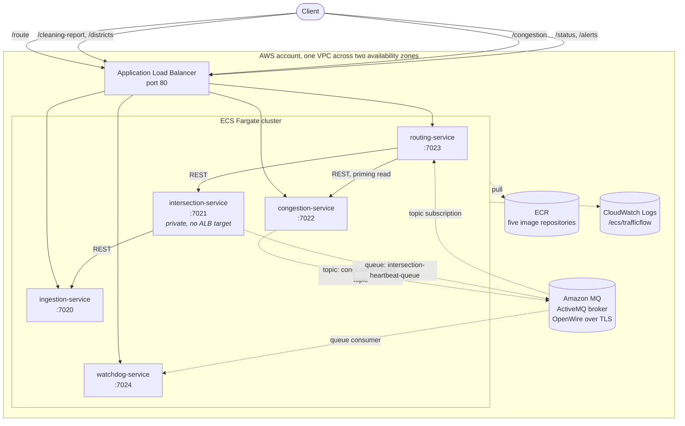

# Deploying TrafficFlow to AWS

TrafficFlow was built to run on a laptop: five Java services, a broker, and a
PowerShell script that opens six windows. This folder is the work of taking that
same system and describing it as infrastructure, so it can run on AWS without
the application code changing.

That last part is the point. The five services already read every address they
need from an environment variable. Nothing knows it is on a laptop, and nothing
needs to know it is on AWS.

```
INGESTION_URL     http://localhost:7020      ->  http://ingestion.trafficflow.local:7020
INTERSECTION_URL  http://localhost:7021      ->  http://intersection.trafficflow.local:7021
CONGESTION_URL    http://localhost:7022      ->  http://congestion.trafficflow.local:7022
BROKER_URL        tcp://localhost:61616      ->  ssl://b-xxxx.mq.eu-west-1.amazonaws.com:61617
```

---

## Architecture



Solid arrows are REST calls. Dotted arrows are JMS messages. The two dotted
paths are the ones worth looking at, because they are different on purpose: the
congestion level goes to a **topic** so that every interested subscriber sees
every change, and the heartbeat goes to a **queue** because there the meaningful
signal is absence, and a queue holds messages while the watchdog restarts.

Moving to AWS did not change that decision. Amazon MQ is ActiveMQ, so the topic
and the queue are the same destinations with the same semantics. What changed is
who patches the broker.

---

## What maps to what

| On a laptop | On AWS | Why |
|---|---|---|
| `java -jar routing-service.jar` in a terminal | ECS Fargate task | No servers to patch, and a task that dies is replaced |
| `scripts/run-all.ps1` | Five ECS services, `DesiredCount: 1` | Desired state instead of a script that has to be re-run |
| ActiveMQ container from `common/docker-compose.yml` | Amazon MQ, single instance `mq.t3.micro` | The broker is the one component whose failure stops the messaging, and its patching is not work worth owning |
| `localhost:7021` | `intersection.trafficflow.local:7021` via Cloud Map | A task that restarts gets a new IP; the DNS name follows it |
| Opening `http://localhost:7023` | Application Load Balancer on port 80 | One public entry point, health checks, and services that stay private |
| A jar on disk | ECR image tagged with the git sha | The deployed version has a name, so a rollback is a decision rather than a guess |
| Console output in six windows | CloudWatch Logs, one group, five stream prefixes | Logs outlive the task that wrote them |
| Nothing | Security groups | Each service accepts traffic only from the load balancer and from the others |

---

## One change the application needs

Amazon MQ requires authentication and TLS. The local broker requires neither, so
`Broker` connects with a URL alone:

```java
this.factory = new ActiveMQConnectionFactory(url);
```

To reach Amazon MQ it needs credentials, which the CloudFormation template
already passes in as `BROKER_USER` and `BROKER_PASSWORD`:

```java
String user = System.getenv("BROKER_USER");
String password = System.getenv("BROKER_PASSWORD");
this.factory = (user == null || user.isBlank())
        ? new ActiveMQConnectionFactory(url)
        : new ActiveMQConnectionFactory(user, password, url);
```

The same change goes in all four copies of `Broker.java`, and it is
backwards compatible: with no environment variables set, the behaviour is
exactly what it is today.

The `ssl://` scheme needs no extra work. Amazon MQ presents a certificate from a
public certificate authority that the JDK already trusts, so there is no
truststore to configure.

**This change has not been applied to the services.** The code in this repository
is the version that was built, run and marked, and it is left alone. The change
is written out here because knowing exactly what is missing is more useful than
a deployment that silently would not connect.

---

## Running the whole system in containers, locally

```bash
docker compose -f aws/docker-compose.yml up --build
```

Then the same demo as always, against containers instead of jars:

```bash
curl http://localhost:7020/cleaning-report
curl "http://localhost:7023/route?from=INT-1001&to=INT-1002"
curl -X POST http://localhost:7022/congestion \
     -H 'Content-Type: application/json' \
     -d '{"level":6,"reason":"Accident on the M1"}'
curl "http://localhost:7023/route?from=INT-1001&to=INT-1002"   # slower now
curl http://localhost:7024/status
```

This is the rehearsal for AWS. Every address arrives as an environment variable
in the compose file exactly as it will in the task definitions, so if a service
works here it is not going to fail on AWS for a reason to do with how it finds
its neighbours.

One caveat, and the root README records the same one: Docker Desktop cannot be
installed on the machine this was developed on, because the IT policy disables
Virtual Machine Platform. That is why `broker/` exists as a plain jar. The
compose file above is therefore built and exercised by CI rather than on that
machine, which is the reason the images job in `.github/workflows/build.yml` is
there at all.

---

## Deploying

```powershell
.\aws\scripts\deploy.ps1 -MqPassword "choose-something-long"
```

```bash
MQ_PASSWORD='choose-something-long' ./aws/scripts/deploy.sh
```

Both do the same four things: deploy the ECR stack, build the five images, push
them tagged with the short git sha, then deploy the application stack. The
Amazon MQ broker takes around fifteen minutes to create the first time, which is
most of the wait.

Requirements: AWS CLI v2, Docker, and credentials allowed to create VPC, ECS,
ELB, ECR, Amazon MQ, IAM and CloudWatch resources.

Tear it down when the demo is over:

```bash
aws cloudformation delete-stack --stack-name trafficflow-app --region eu-west-1
```

The ECR stack is deliberately left alone by that command, so the images survive
a teardown and the next deploy is fast.

---

## Cost

Nothing here is in the free tier for long. The rough monthly shape, running
continuously in `eu-west-1`:

| Resource | Roughly |
|---|---|
| 5 Fargate tasks at 0.25 vCPU / 0.5 GB | the largest line |
| Amazon MQ `mq.t3.micro`, single instance | the second largest |
| Application Load Balancer | charged hourly whether or not anything calls it |
| ECR, CloudWatch Logs | small, and capped by the lifecycle policy and 7 day retention |

Two deliberate savings are already in the template. There is **no NAT gateway**:
tasks run in public subnets with public IPs so they can pull from ECR, and are
protected by security groups rather than by being unroutable. And Container
Insights is off. Both are the right call for a student deployment and the wrong
call for anything holding real data, which is why they are commented where they
appear rather than left as silent defaults.

The honest advice is to deploy it, demonstrate it, screenshot it, and delete the
stack the same day.

---

## Known limitations

**Four services define `/status`.** A single load balancer cannot publish all of
them on one path, so the watchdog gets it and the others are reachable only from
inside the VPC. The two real fixes are to give each service a path prefix it
serves itself, or to put an API gateway in front that rewrites the path. Neither
is worth doing for a five service demo, but pretending the conflict does not
exist would be worse.

**`DesiredCount` is 1 for every service.** Each one holds its state in memory, so
a second congestion task would keep its own congestion level and the two would
disagree. Scaling out means moving that state to a shared store first. This is
the same limitation the root README already records, and deploying it to AWS
does not remove it, it just makes it easier to trip over.

**The broker password is a CloudFormation parameter.** It is `NoEcho`, so it does
not appear in stack output, but the right home for it is Secrets Manager with the
container `secrets` field injecting it at start-up. That is a small change and a
worthwhile next one.

**Single availability zone for the broker.** `SINGLE_INSTANCE` means broker
maintenance is a short outage. The system tolerates it, which is exactly what the
congestion service's `"published": false` response was written for, but
`ACTIVE_STANDBY_MULTI_AZ` is the production answer.

---

## What has been verified, and what has not

Being straight about this matters more than a clean claim.

- **Verified:** the five services themselves, run end to end on a Windows
  machine, 51 tests passing. That is the work the root README describes.
- **Verified by CI:** `.github/workflows/build.yml` runs every service's tests
  and builds all five container images on each push. A green run means the
  Dockerfile works.
- **Not verified:** the CloudFormation templates have not been deployed to a
  live AWS account. They are written against the documented resource
  specifications and are syntactically valid, but an unrun template is a
  hypothesis. The first real deployment will find something.

---

## Background

The cloud reasoning here came out of two AWS Educate courses, Cloud 101 and
Introduction to the AWS Management Console, applied to a system I had already
built rather than to a tutorial. The idea that shaped most of the decisions above
is the shared responsibility model: working out which failures are mine to design
for, and which ones I am paying someone else to have already thought about.
Amazon MQ instead of a broker container is that line drawn in one place. Security
groups instead of a NAT gateway is the same line drawn somewhere cheaper, on
purpose, with the trade-off written down.
